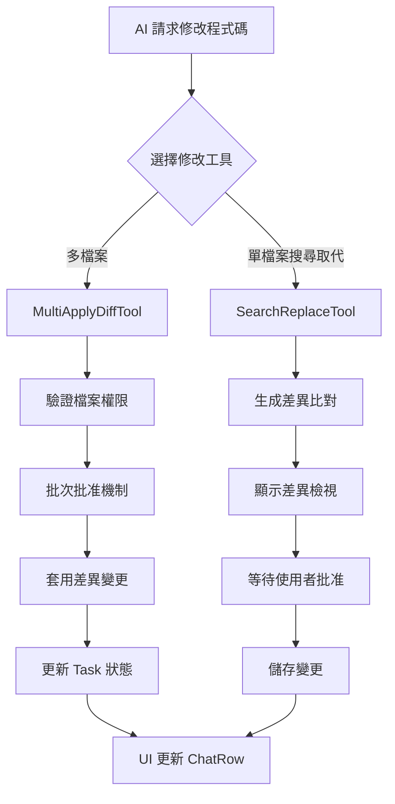

# Python 實現程式碼修改功能的完整計劃

## 核心架構設計

### 1. 主要類別結構

```python
# 核心工具類別
class MultiApplyDiffTool:
    """多檔案差異比對工具 - 對應 MultiApplyDiffTool.ts"""
    
class SearchReplaceTool:
    """搜尋取代工具 - 對應 SearchReplaceTool.ts"""
    
class DiffStrategy:
    """差異比對策略介面"""
    
class Task:
    """任務管理類別 - 對應 Task.ts"""
```

### 2. 資料模型

```python
from dataclasses import dataclass
from typing import List, Optional, Dict, Any
from enum import Enum

class OperationStatus(Enum):
    PENDING = "pending"
    APPROVED = "approved"
    DENIED = "denied"
    BLOCKED = "blocked"
    ERROR = "error"

@dataclass
class DiffOperation:
    path: str
    diff: List[Dict[str, Any]]

@dataclass
class OperationResult:
    path: str
    status: OperationStatus
    error: Optional[str] = None
    result: Optional[str] = None
    diff_items: Optional[List[Dict[str, Any]]] = None
    absolute_path: Optional[str] = None
    file_exists: Optional[bool] = None
```

## 實現步驟

### 階段一：基礎架構

1. **建立專案結構**
```
code_modifier/
├── core/
│   ├── tools/
│   │   ├── multi_apply_diff_tool.py
│   │   ├── search_replace_tool.py
│   │   └── base_tool.py
│   ├── diff/
│   │   ├── strategy.py
│   │   └── stats.py
│   └── task.py
├── utils/
│   ├── file_utils.py
│   ├── path_utils.py
│   └── xml_utils.py
├── tests/
└── examples/
```

2. **實現基礎工具類別**
```python
# core/tools/base_tool.py
from abc import ABC, abstractmethod
from typing import Dict, Any

class BaseTool(ABC):
    @abstractmethod
    async def execute(self, params: Dict[str, Any], task: 'Task', callbacks: Dict[str, Any]) -> None:
        pass
    
    @abstractmethod
    def parse_legacy(self, params: Dict[str, Any]) -> Dict[str, Any]:
        pass
```

### 階段二：核心功能實現

1. **MultiApplyDiffTool 實現**
```python
# core/tools/multi_apply_diff_tool.py
import asyncio
import xml.etree.ElementTree as ET
from pathlib import Path
from typing import List, Dict, Any

class MultiApplyDiffTool(BaseTool):
    def __init__(self):
        self.experiments = Experiments()
        
    async def execute(self, params: Dict[str, Any], task: 'Task', callbacks: Dict[str, Any]) -> None:
        """實現多檔案差異比對邏輯"""
        # 1. 解析 XML 參數
        operations = await self._parse_operations(params)
        
        # 2. 驗證檔案權限
        validated_ops = await self._validate_operations(operations, task)
        
        # 3. 批次批准機制
        approved_ops = await self._handle_batch_approval(validated_ops, task, callbacks)
        
        # 4. 套用變更
        results = await self._apply_changes(approved_ops, task)
        
        # 5. 回傳結果
        callbacks['push_tool_result'](results)
    
    async def _parse_operations(self, params: Dict[str, Any]) -> List[DiffOperation]:
        """解析 XML 參數，對應原始程式碼的 XML 解析邏輯"""
        # 實現 XML 解析邏輯
        pass
    
    async def _validate_operations(self, operations: List[DiffOperation], task: 'Task') -> List[OperationResult]:
        """驗證檔案權限和存在性"""
        # 對應 MultiApplyDiffTool.ts 的驗證階段
        pass
    
    async def _handle_batch_approval(self, operations: List[OperationResult], task: 'Task', callbacks: Dict[str, Any]) -> List[OperationResult]:
        """處理批次批准機制"""
        # 對應原始程式碼的批次批准邏輯
        pass
```

2. **SearchReplaceTool 實現**
```python
# core/tools/search_replace_tool.py
class SearchReplaceTool(BaseTool):
    async def execute(self, params: Dict[str, Any], task: 'Task', callbacks: Dict[str, Any]) -> None:
        """實現搜尋取代邏輯"""
        file_path = params['file_path']
        old_string = params['old_string']
        new_string = params['new_string']
        
        # 1. 驗證參數
        self._validate_params(file_path, old_string, new_string)
        
        # 2. 讀取檔案
        content = await self._read_file(file_path, task)
        
        # 3. 檢查匹配
        match_count = content.count(old_string)
        if match_count != 1:
            raise ValueError(f"Expected 1 match, found {match_count}")
        
        # 4. 套用變更
        new_content = content.replace(old_string, new_string)
        
        # 5. 產生差異並請求批准
        diff = self._generate_diff(file_path, content, new_content)
        approved = await self._request_approval(diff, callbacks)
        
        if approved:
            await self._save_file(file_path, new_content, task)
```

### 階段三：差異策略實現

```python
# core/diff/strategy.py
from abc import ABC, abstractmethod

class DiffStrategy(ABC):
    @abstractmethod
    async def apply_diff(self, original: str, diff_items: List[Dict[str, Any]]) -> Dict[str, Any]:
        """應用差異變更"""
        pass

class StandardDiffStrategy(DiffStrategy):
    async def apply_diff(self, original: str, diff_items: List[Dict[str, Any]]) -> Dict[str, Any]:
        """標準差異應用策略"""
        # 實現 SEARCH/REPLACE 區塊解析和應用
        pass

class UnifiedDiffStrategy(DiffStrategy):
    async def apply_diff(self, original: str, diff_items: List[Dict[str, Any]]) -> Dict[str, Any]:
        """統一差異格式策略"""
        pass
```

### 階段四：輔助功能

1. **檔案操作工具**
```python
# utils/file_utils.py
import aiofiles
from pathlib import Path

async def file_exists_at_path(path: Path) -> bool:
    """檢查檔案是否存在"""
    return path.exists() and path.is_file()

async def read_file_content(path: Path) -> str:
    """非同步讀取檔案內容"""
    async with aiofiles.open(path, 'r', encoding='utf-8') as f:
        return await f.read()

async def write_file_content(path: Path, content: str) -> None:
    """非同步寫入檔案內容"""
    async with aiofiles.open(path, 'w', encoding='utf-8') as f:
        await f.write(content)
```

2. **XML 解析工具**
```python
# utils/xml_utils.py
import xml.etree.ElementTree as ET
from typing import Dict, Any, List

def parse_xml_for_diff(xml_content: str, preserve_tags: List[str]) -> Dict[str, Any]:
    """解析 XML 內容，保持特定標籤不進行 HTML 實體解碼"""
    # 對應原始程式碼的 parseXmlForDiff 函數
    pass

def unescape_html_entities(text: str) -> str:
    """HTML 實體解碼"""
    import html
    return html.unescape(text)
```

### 階段五：測試實現

```python
# tests/test_multi_apply_diff_tool.py
import pytest
from unittest.mock import Mock, AsyncMock
from core.tools.multi_apply_diff_tool import MultiApplyDiffTool

@pytest.mark.asyncio
async def test_multi_file_diff_application():
    """測試多檔案差異應用"""
    tool = MultiApplyDiffTool()
    mock_task = create_mock_task()
    mock_callbacks = create_mock_callbacks()
    
    params = {
        'args': '''
        <file>
            <path>test1.py</path>
            <diff>
                <content><<<<<<< SEARCH\nold\n=======\nnew\n>>>>>>> REPLACE</content>
            </diff>
        </file>
        <file>
            <path>test2.py</path>
            <diff>
                <content><<<<<<< SEARCH\nold2\n=======\nnew2\n>>>>>>> REPLACE</content>
            </diff>
        </file>
        '''
    }
    
    await tool.execute(params, mock_task, mock_callbacks)
    
    # 驗證結果
    assert mock_callbacks['push_tool_result'].called
```

## 技術考量

### 1. 非同步處理
- 使用 `asyncio` 和 `aiofiles` 進行非同步檔案操作
- 實現並行處理多檔案操作

### 2. 錯誤處理
```python
# core/exceptions.py
class CodeModifierException(Exception):
    """程式碼修改基礎異常"""
    pass

class FileAccessError(CodeModifierException):
    """檔案存取錯誤"""
    pass

class DiffApplicationError(CodeModifierException):
    """差異應用錯誤"""
    pass
```

### 3. 設定管理
```python
# core/config.py
from dataclasses import dataclass
from typing import Dict, Any

@dataclass
class ModifierConfig:
    enable_multi_file_diff: bool = True
    enable_prevent_focus_disruption: bool = False
    write_delay_ms: int = 100
    diagnostics_enabled: bool = True
    experiments: Dict[str, bool] = None
```

## 實現時程

1. **第 1-2 週**：建立基礎架構和資料模型
2. **第 3-4 週**：實現 `MultiApplyDiffTool` 核心功能
3. **第 5 週**：實現 `SearchReplaceTool` 和差異策略
4. **第 6 週**：實現輔助工具和錯誤處理
5. **第 7-8 週**：完善測試和文件

## Notes

這個計劃基於原始 TypeScript 程式碼的架構設計，特別是 `MultiApplyDiffTool.ts` [1](#1-0)  和 `SearchReplaceTool.ts` [2](#1-1)  的核心邏輯。Python 實現將保持相同的設計模式和功能特性，包括批次批准機制、檔案權限驗證、差異應用策略等。

### Citations

**File:** src/core/tools/MultiApplyDiffTool.ts (L56-127)
```typescript
export async function applyDiffTool(
	cline: Task,
	block: ToolUse,
	askApproval: AskApproval,
	handleError: HandleError,
	pushToolResult: PushToolResult,
	removeClosingTag: RemoveClosingTag,
) {
	// Check if native protocol is enabled - if so, always use single-file class-based tool
	const toolProtocol = resolveToolProtocol(cline.apiConfiguration, cline.api.getModel().info)
	if (isNativeProtocol(toolProtocol)) {
		return applyDiffToolClass.handle(cline, block as ToolUse<"apply_diff">, {
			askApproval,
			handleError,
			pushToolResult,
			removeClosingTag,
			toolProtocol,
		})
	}

	// Check if MULTI_FILE_APPLY_DIFF experiment is enabled
	const provider = cline.providerRef.deref()
	const state = await provider?.getState()
	if (provider && state) {
		const isMultiFileApplyDiffEnabled = experiments.isEnabled(
			state.experiments ?? {},
			EXPERIMENT_IDS.MULTI_FILE_APPLY_DIFF,
		)

		// If experiment is disabled, use single-file class-based tool
		if (!isMultiFileApplyDiffEnabled) {
			return applyDiffToolClass.handle(cline, block as ToolUse<"apply_diff">, {
				askApproval,
				handleError,
				pushToolResult,
				removeClosingTag,
				toolProtocol,
			})
		}
	}

	// Otherwise, continue with new multi-file implementation
	const argsXmlTag: string | undefined = block.params.args
	const legacyPath: string | undefined = block.params.path
	const legacyDiffContent: string | undefined = block.params.diff
	const legacyStartLineStr: string | undefined = block.params.start_line

	let operationsMap: Record<string, DiffOperation> = {}
	let usingLegacyParams = false
	let filteredOperationErrors: string[] = []

	// Handle partial message first
	if (block.partial) {
		let filePath = ""
		if (argsXmlTag) {
			const match = argsXmlTag.match(/<file>.*?<path>([^<]+)<\/path>/s)
			if (match) {
				filePath = match[1]
			}
		} else if (legacyPath) {
			// Use legacy path if argsXmlTag is not present for partial messages
			filePath = legacyPath
		}

		const sharedMessageProps: ClineSayTool = {
			tool: "appliedDiff",
			path: getReadablePath(cline.cwd, filePath),
		}
		const partialMessage = JSON.stringify(sharedMessageProps)
		await cline.ask("tool", partialMessage, block.partial).catch(() => {})
		return
	}
```

**File:** src/core/tools/SearchReplaceTool.ts (L34-115)
```typescript
	async execute(params: SearchReplaceParams, task: Task, callbacks: ToolCallbacks): Promise<void> {
		const { file_path, old_string, new_string } = params
		const { askApproval, handleError, pushToolResult, toolProtocol } = callbacks

		try {
			// Validate required parameters
			if (!file_path) {
				task.consecutiveMistakeCount++
				task.recordToolError("search_replace")
				pushToolResult(await task.sayAndCreateMissingParamError("search_replace", "file_path"))
				return
			}

			if (!old_string) {
				task.consecutiveMistakeCount++
				task.recordToolError("search_replace")
				pushToolResult(await task.sayAndCreateMissingParamError("search_replace", "old_string"))
				return
			}

			if (new_string === undefined) {
				task.consecutiveMistakeCount++
				task.recordToolError("search_replace")
				pushToolResult(await task.sayAndCreateMissingParamError("search_replace", "new_string"))
				return
			}

			// Validate that old_string and new_string are different
			if (old_string === new_string) {
				task.consecutiveMistakeCount++
				task.recordToolError("search_replace")
				pushToolResult(
					formatResponse.toolError(
						"The 'old_string' and 'new_string' parameters must be different.",
						toolProtocol,
					),
				)
				return
			}

			// Determine relative path - file_path can be absolute or relative
			let relPath: string
			if (path.isAbsolute(file_path)) {
				relPath = path.relative(task.cwd, file_path)
			} else {
				relPath = file_path
			}

			const accessAllowed = task.rooIgnoreController?.validateAccess(relPath)

			if (!accessAllowed) {
				await task.say("rooignore_error", relPath)
				pushToolResult(formatResponse.rooIgnoreError(relPath, toolProtocol))
				return
			}

			// Check if file is write-protected
			const isWriteProtected = task.rooProtectedController?.isWriteProtected(relPath) || false

			const absolutePath = path.resolve(task.cwd, relPath)

			const fileExists = await fileExistsAtPath(absolutePath)
			if (!fileExists) {
				task.consecutiveMistakeCount++
				task.recordToolError("search_replace")
				const errorMessage = `File not found: ${relPath}. Cannot perform search and replace on a non-existent file.`
				await task.say("error", errorMessage)
				pushToolResult(formatResponse.toolError(errorMessage, toolProtocol))
				return
			}

			let fileContent: string
			try {
				fileContent = await fs.readFile(absolutePath, "utf8")
			} catch (error) {
				task.consecutiveMistakeCount++
				task.recordToolError("search_replace")
				const errorMessage = `Failed to read file '${relPath}'. Please verify file permissions and try again.`
				await task.say("error", errorMessage)
				pushToolResult(formatResponse.toolError(errorMessage, toolProtocol))
				return
			}
```

---

## 專案中程式碼修改相關的核心檔案與邏輯

### 核心修改工具

#### 1. MultiApplyDiffTool.ts - 多檔案差異比對工具
這是最重要的程式碼修改工具，處理批量檔案修改 [1](#0-0) ：

- **驗證階段**：檢查檔案存取權限、寫入保護狀態、檔案是否存在
- **批准階段**：支援單檔案和批次批准機制 [2](#0-1) 
- **套用階段**：實際執行差異比對並寫入檔案 [3](#0-2) 

#### 2. SearchReplaceTool.ts - 搜尋取代工具
處理單一檔案的搜尋和取代操作 [4](#0-3) ：

- 生成並驗證差異比對
- 支援防干擾模式（preventFocusDisruption）
- 提供差異檢視和直接儲存兩種模式

### 任務管理系統

#### 3. Task.ts - 核心任務類別
包含程式碼修改相關的關鍵屬性 [5](#0-4) ：

- `diffViewProvider`: 差異檢視提供者
- `diffStrategy`: 差異比對策略
- `diffEnabled`: 差異功能啟用狀態
- `didEditFile`: 檔案編輯狀態追蹤

#### 4. ClineProvider.ts - 任務堆疊管理
從 Task Stack and Subtasks 文件可見，管理任務的執行順序和生命週期，包括：
- LIFO 堆疊結構管理
- 任務建立和銷毀
- 父子任務關係維護

### 使用者介面

#### 5. ChatRow.tsx - 聊天列元件
顯示程式碼修改結果的 UI 元件 [6](#0-5) ：

- 顯示差異比對內容
- 處理新檔案建立通知
- 支援展開/收起差異檢視

### 設定與本地化

#### 6. zh-TW/settings.json - 繁體中文設定
包含差異比對相關的設定選項 [7](#0-6) ：

- 差異比對策略選項（標準、多區塊、統一）
- 比對精確度設定
- 實驗性功能開關

### 工作流程定義

#### 7. XML 工作流程檔案
定義程式碼修改的標準流程：
- `.roo/rules-issue-fixer/1_Workflow.xml` - 問題修復工作流程 [8](#0-7) 
- `.roo/rules-issue-writer/1_workflow.xml` - 問題撰寫工作流程 [9](#0-8) 

## 運作邏輯流程



## Notes

- 核心修改邏輯集中在 `MultiApplyDiffTool.ts` 和 `SearchReplaceTool.ts`
- 任務管理系統透過 `Task.ts` 和 `ClineProvider.ts` 協調修改操作
- 支援多種差異比對策略和實驗性功能
- 完整的權限檢查和批准機制確保安全性
- UI 層提供即時的差異檢視和狀態回饋

Wiki pages you might want to explore:
- [Task Stack and Subtasks (RooCodeInc/Roo-Code)](/wiki/RooCodeInc/Roo-Code#5.2)

### Citations

**File:** src/core/tools/MultiApplyDiffTool.ts (L224-301)
```typescript
	// If no operations were extracted, bail out
	if (Object.keys(operationsMap).length === 0) {
		cline.consecutiveMistakeCount++
		cline.recordToolError("apply_diff")
		pushToolResult(
			await cline.sayAndCreateMissingParamError(
				"apply_diff",
				usingLegacyParams
					? "legacy 'path' and 'diff' (must be valid and non-empty)"
					: "args (must contain at least one valid file element)",
			),
		)
		cline.processQueuedMessages()
		return
	}

	// Convert map to array of operations for processing
	const operations = Object.values(operationsMap)

	const operationResults: OperationResult[] = operations.map((op) => ({
		path: op.path,
		status: "pending",
		diffItems: op.diff,
	}))

	// Function to update operation result
	const updateOperationResult = (path: string, updates: Partial<OperationResult>) => {
		const index = operationResults.findIndex((result) => result.path === path)
		if (index !== -1) {
			operationResults[index] = { ...operationResults[index], ...updates }
		}
	}

	try {
		// First validate all files and prepare for batch approval
		const operationsToApprove: OperationResult[] = []
		const allDiffErrors: string[] = [] // Collect all diff errors

		for (const operation of operations) {
			const { path: relPath, diff: diffItems } = operation

			// Verify file access is allowed
			const accessAllowed = cline.rooIgnoreController?.validateAccess(relPath)
			if (!accessAllowed) {
				await cline.say("rooignore_error", relPath)
				updateOperationResult(relPath, {
					status: "blocked",
					error: formatResponse.rooIgnoreError(relPath, undefined),
				})
				continue
			}

			// Check if file is write-protected
			const isWriteProtected = cline.rooProtectedController?.isWriteProtected(relPath) || false

			// Verify file exists
			const absolutePath = path.resolve(cline.cwd, relPath)
			const fileExists = await fileExistsAtPath(absolutePath)
			if (!fileExists) {
				updateOperationResult(relPath, {
					status: "blocked",
					error: `File does not exist at path: ${absolutePath}`,
				})
				continue
			}

			// Add to operations that need approval
			const opResult = operationResults.find((r) => r.path === relPath)
			if (opResult) {
				opResult.absolutePath = absolutePath
				opResult.fileExists = fileExists
				operationsToApprove.push(opResult)
			}
		}

		// Handle batch approval if there are multiple files
		if (operationsToApprove.length > 1) {
			// Check if any files are write-protected
```

**File:** src/core/tools/MultiApplyDiffTool.ts (L420-458)
```typescript
						const individualPermissions = parsedResponse
						let hasAnyDenial = false

						batchDiffs.forEach((batchDiff, index) => {
							const opResult = operationsToApprove[index]
							const approved = individualPermissions[batchDiff.key] === true

							if (approved) {
								updateOperationResult(opResult.path, { status: "approved" })
							} else {
								hasAnyDenial = true
								updateOperationResult(opResult.path, {
									status: "denied",
									result: `Changes to ${opResult.path} were not approved by user`,
								})
							}
						})

						if (hasAnyDenial) {
							cline.didRejectTool = true
						}
					}
				} catch (error) {
					// Fallback: if JSON parsing fails, deny all files
					console.error("Failed to parse individual permissions:", error)
					cline.didRejectTool = true
					operationsToApprove.forEach((opResult) => {
						updateOperationResult(opResult.path, {
							status: "denied",
							result: `Changes to ${opResult.path} were not approved by user`,
						})
					})
				}
			}
		} else if (operationsToApprove.length === 1) {
			// Single file approval - process immediately
			const opResult = operationsToApprove[0]
			updateOperationResult(opResult.path, { status: "approved" })
		}
```

**File:** src/core/tools/MultiApplyDiffTool.ts (L613-719)
```typescript
					let toolProgressStatus
					if (cline.diffStrategy && cline.diffStrategy.getProgressStatus) {
						toolProgressStatus = cline.diffStrategy.getProgressStatus(
							{
								...block,
								params: { ...block.params, diff: diffContents },
							},
							{ success: true },
						)
					}

					// Set up diff view
					cline.diffViewProvider.editType = "modify"

					// Show diff view if focus disruption prevention is disabled
					if (!isPreventFocusDisruptionEnabled) {
						await cline.diffViewProvider.open(relPath)
						await cline.diffViewProvider.update(originalContent!, true)
						cline.diffViewProvider.scrollToFirstDiff()
					} else {
						// For direct save, we still need to set originalContent
						cline.diffViewProvider.originalContent = await fs.readFile(absolutePath, "utf-8")
					}

					// Ask for approval (same for both flows)
					const isWriteProtected = cline.rooProtectedController?.isWriteProtected(relPath) || false
					didApprove = await askApproval("tool", operationMessage, toolProgressStatus, isWriteProtected)

					if (!didApprove) {
						// Revert changes if diff view was shown
						if (!isPreventFocusDisruptionEnabled) {
							await cline.diffViewProvider.revertChanges()
						}
						results.push(`Changes to ${relPath} were not approved by user`)
						continue
					}

					// Save the changes
					if (isPreventFocusDisruptionEnabled) {
						// Direct file write without diff view or opening the file
						await cline.diffViewProvider.saveDirectly(
							relPath,
							originalContent!,
							false,
							diagnosticsEnabled,
							writeDelayMs,
						)
					} else {
						// Call saveChanges to update the DiffViewProvider properties
						await cline.diffViewProvider.saveChanges(diagnosticsEnabled, writeDelayMs)
					}
				} else {
					// Batch operations - already approved above
					if (isPreventFocusDisruptionEnabled) {
						// Direct file write without diff view or opening the file
						cline.diffViewProvider.editType = "modify"
						cline.diffViewProvider.originalContent = await fs.readFile(absolutePath, "utf-8")
						await cline.diffViewProvider.saveDirectly(
							relPath,
							originalContent!,
							false,
							diagnosticsEnabled,
							writeDelayMs,
						)
					} else {
						// Original behavior with diff view
						cline.diffViewProvider.editType = "modify"
						await cline.diffViewProvider.open(relPath)
						await cline.diffViewProvider.update(originalContent!, true)
						cline.diffViewProvider.scrollToFirstDiff()

						// Call saveChanges to update the DiffViewProvider properties
						await cline.diffViewProvider.saveChanges(diagnosticsEnabled, writeDelayMs)
					}
				}

				// Track file edit operation
				await cline.fileContextTracker.trackFileContext(relPath, "roo_edited" as RecordSource)

				// Used to determine if we should wait for busy terminal to update before sending api request
				cline.didEditFile = true
				let partFailHint = ""

				if (successCount < diffItems.length) {
					partFailHint = `Unable to apply all diff parts to file: ${absolutePath}`
				}

				// Get the formatted response message
				const message = await cline.diffViewProvider.pushToolWriteResult(cline, cline.cwd, !fileExists)

				if (partFailHint) {
					results.push(partFailHint + "\n" + message)
				} else {
					results.push(message)
				}

				await cline.diffViewProvider.reset()
			} catch (error) {
				const errorMsg = error instanceof Error ? error.message : String(error)
				updateOperationResult(relPath, {
					status: "error",
					error: `Error processing ${relPath}: ${errorMsg}`,
				})
				results.push(`Error processing ${relPath}: ${errorMsg}`)
			}
		}

```

**File:** src/core/tools/SearchReplaceTool.ts (L158-217)
```typescript

			// Generate and validate diff
			const diff = formatResponse.createPrettyPatch(relPath, fileContent, newContent)
			if (!diff) {
				pushToolResult(`No changes needed for '${relPath}'`)
				await task.diffViewProvider.reset()
				return
			}

			// Check if preventFocusDisruption experiment is enabled
			const provider = task.providerRef.deref()
			const state = await provider?.getState()
			const diagnosticsEnabled = state?.diagnosticsEnabled ?? true
			const writeDelayMs = state?.writeDelayMs ?? DEFAULT_WRITE_DELAY_MS
			const isPreventFocusDisruptionEnabled = experiments.isEnabled(
				state?.experiments ?? {},
				EXPERIMENT_IDS.PREVENT_FOCUS_DISRUPTION,
			)

			const sanitizedDiff = sanitizeUnifiedDiff(diff)
			const diffStats = computeDiffStats(sanitizedDiff) || undefined
			const isOutsideWorkspace = isPathOutsideWorkspace(absolutePath)

			const sharedMessageProps: ClineSayTool = {
				tool: "appliedDiff",
				path: getReadablePath(task.cwd, relPath),
				diff: sanitizedDiff,
				isOutsideWorkspace,
			}

			const completeMessage = JSON.stringify({
				...sharedMessageProps,
				content: sanitizedDiff,
				isProtected: isWriteProtected,
				diffStats,
			} satisfies ClineSayTool)

			// Show diff view if focus disruption prevention is disabled
			if (!isPreventFocusDisruptionEnabled) {
				await task.diffViewProvider.open(relPath)
				await task.diffViewProvider.update(newContent, true)
				task.diffViewProvider.scrollToFirstDiff()
			}

			const didApprove = await askApproval("tool", completeMessage, undefined, isWriteProtected)

			if (!didApprove) {
				// Revert changes if diff view was shown
				if (!isPreventFocusDisruptionEnabled) {
					await task.diffViewProvider.revertChanges()
				}
				pushToolResult("Changes were rejected by the user.")
				await task.diffViewProvider.reset()
				return
			}

			// Save the changes
			if (isPreventFocusDisruptionEnabled) {
				// Direct file write without diff view or opening the file
				await task.diffViewProvider.saveDirectly(relPath, newContent, false, diagnosticsEnabled, writeDelayMs)
```

**File:** src/core/task/Task.ts (L263-292)
```typescript
	browserSession: BrowserSession

	// Editing
	diffViewProvider: DiffViewProvider
	diffStrategy?: DiffStrategy
	diffEnabled: boolean = false
	fuzzyMatchThreshold: number
	didEditFile: boolean = false

	// LLM Messages & Chat Messages
	apiConversationHistory: ApiMessage[] = []
	clineMessages: ClineMessage[] = []

	// Ask
	private askResponse?: ClineAskResponse
	private askResponseText?: string
	private askResponseImages?: string[]
	public lastMessageTs?: number
	private autoApprovalTimeoutRef?: NodeJS.Timeout

	// Tool Use
	consecutiveMistakeCount: number = 0
	consecutiveMistakeLimit: number
	consecutiveMistakeCountForApplyDiff: Map<string, number> = new Map()
	toolUsage: ToolUsage = {}

	// Checkpoints
	enableCheckpoints: boolean
	checkpointTimeout: number
	checkpointService?: RepoPerTaskCheckpointService
```

**File:** webview-ui/src/components/chat/ChatRow.tsx (L507-566)
```typescript
								code={unifiedDiff ?? tool.diff}
								language="diff"
								progressStatus={message.progressStatus}
								isLoading={message.partial}
								isExpanded={isExpanded}
								onToggleExpand={handleToggleExpand}
								diffStats={tool.diffStats}
							/>
						</div>
					</>
				)
			case "codebaseSearch": {
				return (
					<div style={headerStyle}>
						{toolIcon("search")}
						<span style={{ fontWeight: "bold" }}>
							{tool.path ? (
								<Trans
									i18nKey="chat:codebaseSearch.wantsToSearchWithPath"
									components={{ code: <code></code> }}
									values={{ query: tool.query, path: tool.path }}
								/>
							) : (
								<Trans
									i18nKey="chat:codebaseSearch.wantsToSearch"
									components={{ code: <code></code> }}
									values={{ query: tool.query }}
								/>
							)}
						</span>
					</div>
				)
			}
			case "updateTodoList" as any: {
				const todos = (tool as any).todos || []
				// Get previous todos from the latest todos in the task context
				const previousTodos = getPreviousTodos(clineMessages, message.ts)

				return <TodoChangeDisplay previousTodos={previousTodos} newTodos={todos} />
			}
			case "newFileCreated":
				return (
					<>
						<div style={headerStyle}>
							{tool.isProtected ? (
								<span
									className="codicon codicon-lock"
									style={{ color: "var(--vscode-editorWarning-foreground)", marginBottom: "-1.5px" }}
								/>
							) : (
								toolIcon("new-file")
							)}
							<span style={{ fontWeight: "bold" }}>
								{tool.isProtected
									? t("chat:fileOperations.wantsToEditProtected")
									: t("chat:fileOperations.wantsToCreate")}
							</span>
						</div>
						<div className="pl-6">
							<CodeAccordian
```

**File:** webview-ui/src/i18n/locales/zh-TW/settings.json (L721-780)
```json
	},
	"toolProtocol": {
		"label": "工具呼叫協議",
		"description": "選擇 Roo 如何與 API 通信。原生使用提供者的函數呼叫 API，而 XML 使用 XML 格式的工具定義。",
		"default": "預設",
		"xml": "XML",
		"native": "原生",
		"currentDefault": "預設: {{protocol}}"
	},
	"advanced": {
		"diff": {
			"label": "透過差異比對編輯",
			"description": "啟用後，Roo 可更快速地編輯檔案，並自動拒絕不完整的整檔覆寫",
			"strategy": {
				"label": "差異比對策略",
				"options": {
					"standard": "標準（單一區塊）",
					"multiBlock": "實驗性：多區塊差異",
					"unified": "實驗性：統一差異"
				},
				"descriptions": {
					"standard": "標準策略一次只修改一個程式碼區塊。",
					"unified": "統一差異策略會嘗試多種比對方式，並選擇最佳方案。",
					"multiBlock": "多區塊策略可在單一請求中更新檔案內的多個程式碼區塊。"
				}
			},
			"matchPrecision": {
				"label": "比對精確度",
				"description": "此滑桿控制套用差異時程式碼區段的比對精確度。較低的數值允許更彈性的比對，但也會增加錯誤取代的風險。使用低於 100% 的數值時請特別謹慎。"
			}
		},
		"todoList": {
			"label": "啟用待辦事項清單工具",
			"description": "啟用後，Roo 可以建立和管理待辦事項清單來追蹤任務進度。這有助於將複雜任務組織成可管理的步驟。"
		}
	},
	"experimental": {
		"DIFF_STRATEGY_UNIFIED": {
			"name": "使用實驗性統一差異比對策略",
			"description": "啟用實驗性的統一差異比對策略。此策略可能減少因模型錯誤而導致的重試次數，但也可能導致意外行為或錯誤的編輯。請務必了解風險，並願意仔細檢查所有變更後再啟用。"
		},
		"INSERT_BLOCK": {
			"name": "使用實驗性插入內容工具",
			"description": "啟用實驗性的插入內容工具，允許 Roo 直接在指定行號插入內容，而無需產生差異比對。"
		},
		"POWER_STEERING": {
			"name": "使用實驗性「動力輔助」模式",
			"description": "啟用後，Roo 將更頻繁地提醒模型目前模式的詳細設定。這能讓模型更嚴格遵守角色定義和自訂指令，但每則訊息會使用更多 token。"
		},
		"MULTI_SEARCH_AND_REPLACE": {
			"name": "使用實驗性多區塊差異比對工具",
			"description": "啟用後，Roo 將使用多區塊差異比對工具，嘗試在單一請求中更新檔案內的多個程式碼區塊。"
		},
		"CONCURRENT_FILE_READS": {
			"name": "啟用並行檔案讀取",
			"description": "啟用後，Roo 可以在單一請求中讀取多個檔案（最多 15 個檔案）。停用後，Roo 必須逐一讀取檔案。在使用能力較弱的模型或希望對檔案存取有更多控制時，停用此功能可能會有所幫助。"
		},
		"MARKETPLACE": {
			"name": "啟用 Marketplace",
			"description": "啟用後，您可以從 Marketplace 安裝 MCP 和自訂模式。"
```

**File:** .roo/rules-issue-fixer/1_Workflow.xml (L91-210)
```text
      
      CRITICAL: Always read multiple related files together to understand:
      - Current code patterns and conventions
      - How similar functionality is implemented
      - Testing patterns used in the project
      - Import/export patterns
      - Error handling approaches
      - Configuration and setup patterns
      
      Then use other tools:
      - list_code_definition_names to understand file structure
      - read_file to examine specific implementations (read multiple files at once)
      - search_files for specific patterns or error messages
      
      Also use GitHub CLI to check recent changes:
      <execute_command>
      <command>gh api repos/[owner]/[repo]/commits?path=[file-path]&per_page=10 --jq '.[].sha + " " + .[].commit.message'</command>
      </execute_command>
      
      Search for related PRs:
      <execute_command>
      <command>gh pr list --repo [owner]/[repo] --search "[relevant search terms]" --limit 10</command>
      </execute_command>
      
      Document:
      - All files that need modification
      - Current implementation details and patterns
      - Code conventions to follow (naming, structure, etc.)
      - Test file locations and patterns
      - Related files that might be affected
    </instructions>
  </step>

  <step number="4">
    <name>Create Implementation Plan</name>
    <instructions>
      Based on the issue analysis, create a detailed implementation plan:
      
      For Bug Fixes:
      1. Reproduce the bug locally (if possible)
      2. Identify root cause
      3. Plan the fix approach. The plan should be focused on resolving the issue with a high-quality, targeted fix, while avoiding unrelated changes.
      4. Identify files to modify.
      5. Plan test cases to prevent regression.
      
      For Feature Implementation:
      1. Break down the feature into components
      2. Identify all files that need changes
      3. Plan the implementation approach
      4. Consider edge cases and error handling
      5. Plan test coverage
      
      Present the plan to the user:
      
      <ask_followup_question>
      <question>I've analyzed issue #[number]: "[title]"

      Here's my implementation plan to resolve the issue:

      [Detailed plan with steps and affected files]

      This plan focuses on providing a quality fix for the reported problem without introducing unrelated changes.

      Would you like me to proceed with this implementation?</question>
      <follow_up>
      <suggest>Yes, proceed with the implementation</suggest>
      <suggest>Let me review the issue first</suggest>
      <suggest>Modify the approach for: [specific aspect]</suggest>
      <suggest>Focus only on: [specific part]</suggest>
      </follow_up>
      </ask_followup_question>
    </instructions>
  </step>

  <step number="5">
    <name>Implement the Solution</name>
    <instructions>
      Implement the fix or feature following the plan:
      
      General Guidelines:
      1. Follow existing code patterns and style
      2. Add appropriate error handling
      3. Include necessary comments
      4. Update related documentation
      5. Ensure backward compatibility (if applicable)
      
      For Bug Fixes:
      1. Implement the planned fix, focusing on quality and precision.
      2. The scope of the fix should be as narrow as possible to address the issue. Avoid making changes to code that is not directly related to the fix. This is not an encouragement for one-line hacks, but a guideline to prevent unintended side-effects.
      3. Add regression tests.
      4. Verify the fix resolves the issue.
      5. Check for side effects.
      
      For Features:
      1. Implement incrementally
      2. Test each component as you build
      3. Follow the acceptance criteria exactly
      4. Add comprehensive tests
      5. Update documentation
      
      Use appropriate tools:
      - apply_diff for targeted changes
      - write_to_file for new files
      
      After each significant change, run relevant tests:
      - execute_command to run test suites
      - Check for linting errors
      - Verify functionality works as expected
    </instructions>
  </step>

  <step number="6">
    <name>Verify Acceptance Criteria</name>
    <instructions>
      Systematically verify all acceptance criteria from the issue:
      
      For Bug Fixes:
      1. Confirm the bug no longer reproduces
      2. Follow the exact reproduction steps
      3. Verify expected behavior now occurs
```

**File:** .roo/rules-issue-writer/1_workflow.xml (L481-540)
```text
            </todos>
            </update_todo_list>
          </actions>
        </phase>
        
        <phase number="2" name="Keyword Extraction">
          <description>Extract all relevant keywords, concepts, and technical terms</description>
          <actions>
            - Identify primary technical concepts from user's description
            - Extract error messages or specific symptoms
            - Note any mentioned file paths or components
            - List related features or functionality
            - Include synonyms and related terms
          </actions>
          <update_progress>
            Update the main todo list to mark "Extract keywords" as complete and move to next phase
          </update_progress>
        </phase>
        
        <phase number="3" name="Iterative Search">
          <description>Perform multiple rounds of increasingly focused searches</description>
          
          <iteration name="Initial Broad Search">
            Use codebase_search with all extracted keywords to get an overview of relevant code.
            <codebase_search>
            <query>[Combined keywords from extraction phase]</query>
            <path>[Repository or package path]</path>
            </codebase_search>
          </iteration>
          
          <iteration name="Component Discovery">
            Based on initial results, identify key components and search for:
            - Related class/function definitions
            - Import statements and dependencies
            - Configuration files
            - Test files that might reveal expected behavior
          </iteration>
          
          <iteration name="Deep Implementation Search">
            Search for specific implementation details:
            - Error handling patterns
            - State management
            - API endpoints or routes
            - Database queries or models
            - UI components and their interactions
          </iteration>
          
          <iteration name="Edge Case and Integration Search">
            Look for:
            - Edge cases in the code
            - Integration points with other systems
            - Configuration options that affect behavior
            - Feature flags or conditional logic
          </iteration>
          
          <update_progress>
            After completing all search iterations, update the todo list to show progress
          </update_progress>
        </phase>
        
```
